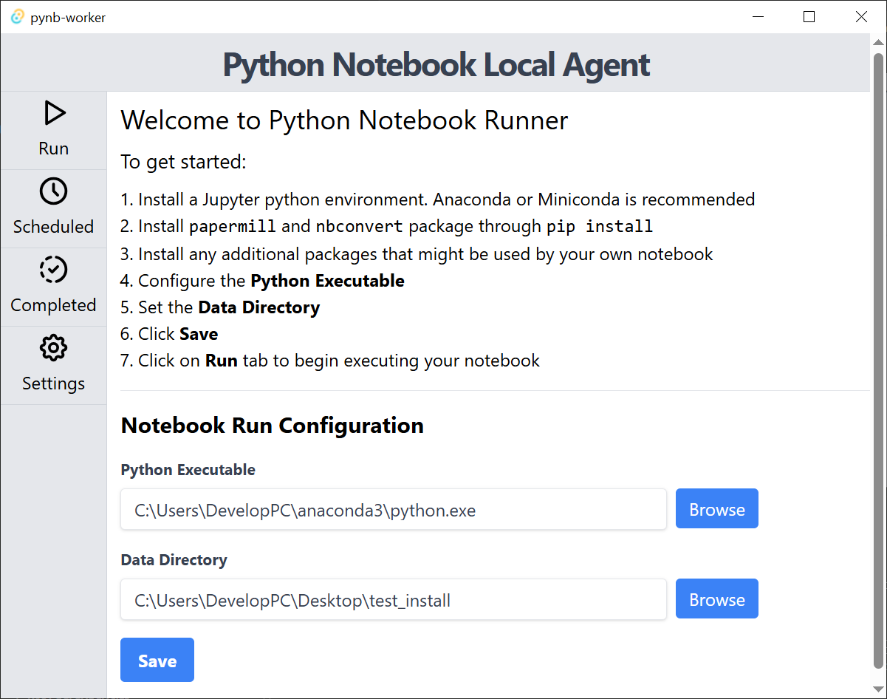
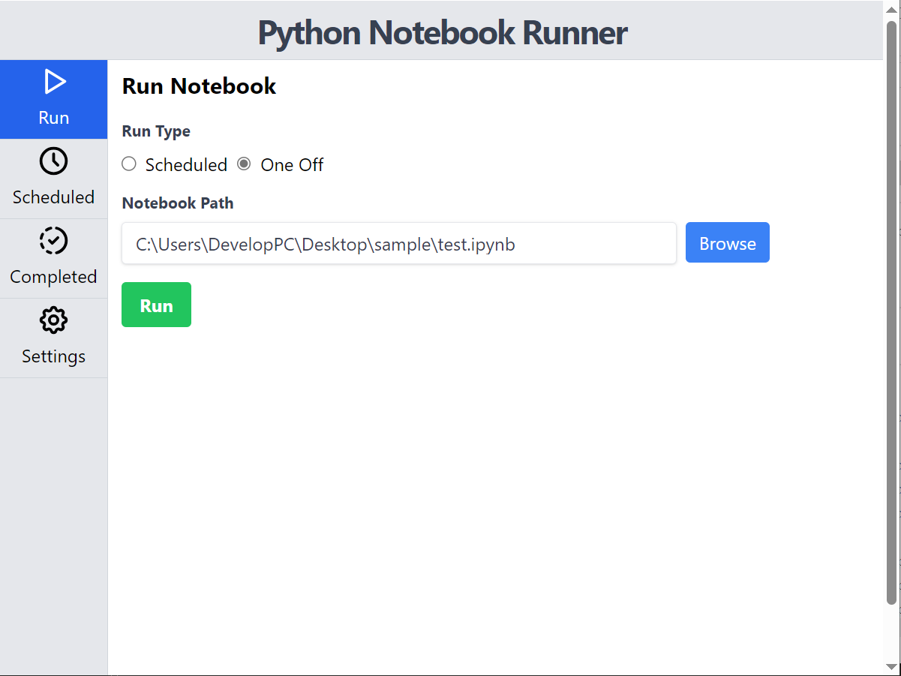
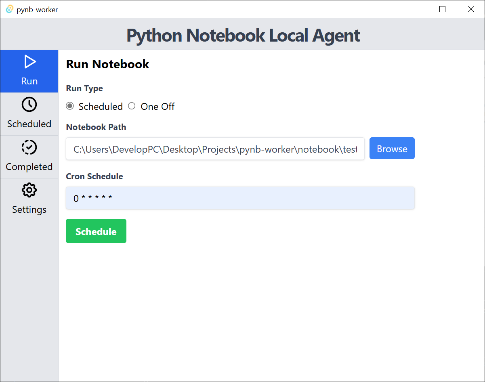
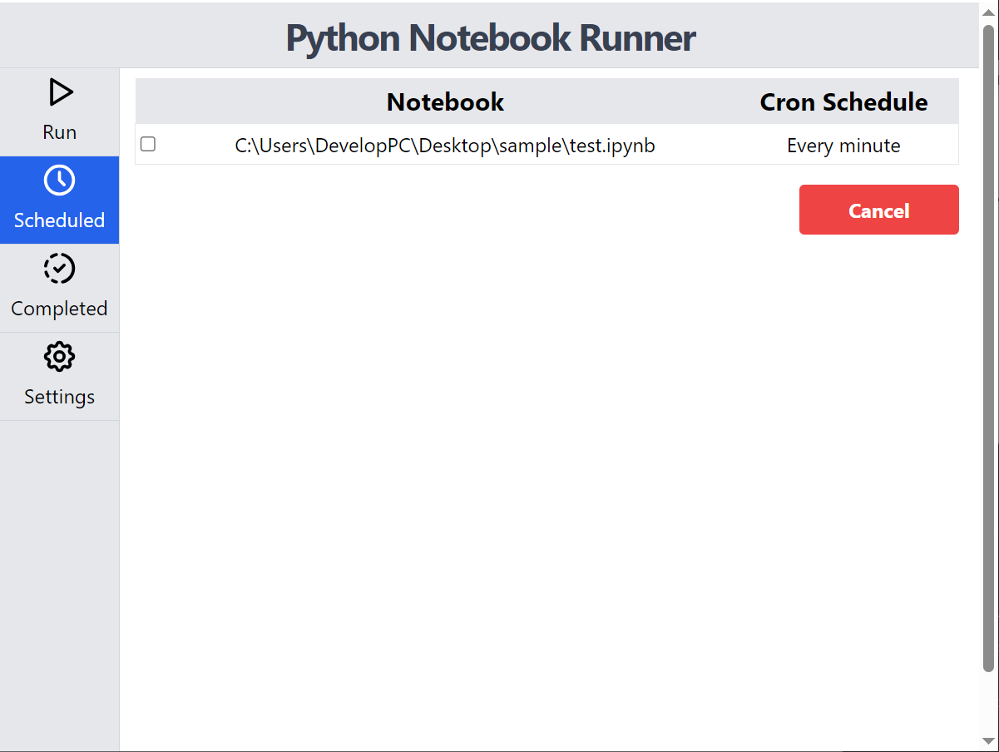
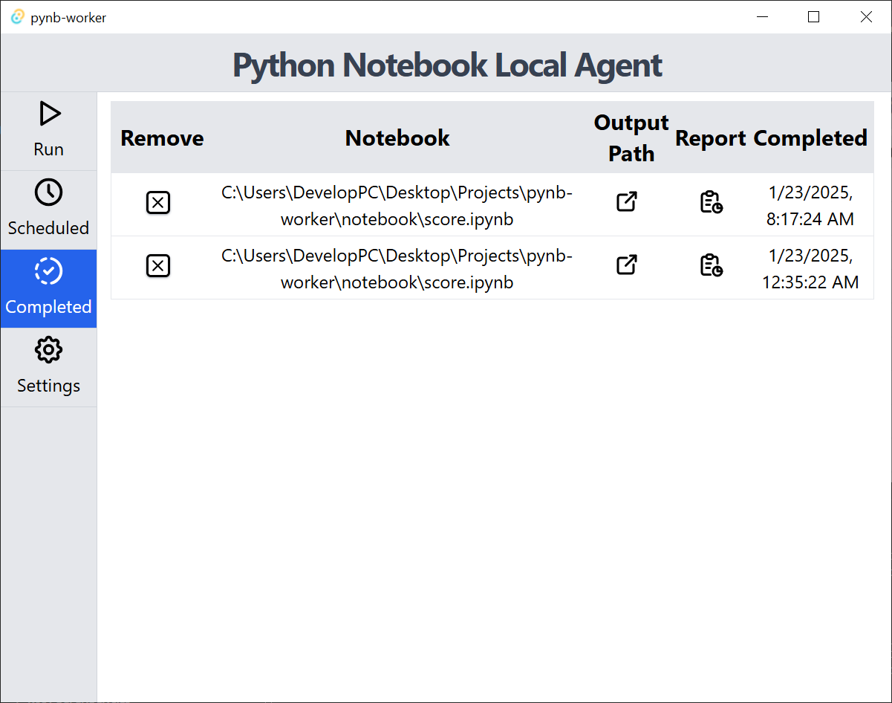
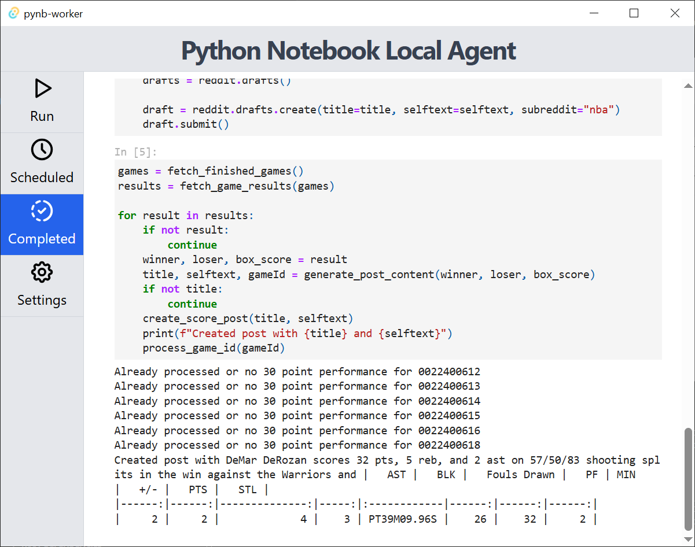

# Python Notebook Local Agent


<div style="display: flex; flex-direction:row;">


</div>

A [Tauri](https://tauri.app) based desktop application which allows a user to run Python notebook on their local machine in the background with user's already available python setup.

## Features:
- Choose either **One-off** or **Schedule** mode
  - **One-Off**: Run a notebook in the background job
  - **Scheduled**: Run a notebook in the background job using a schedule specified by cron string
- View and cancel **Scheduled** notebook jobs
- View pervious runs in the **Completed** tab

## Setup

The application requires the following configuration before you are able to run a notebook

- **Python executable**
  - A data science python environment like *Anaconda* or *Miniconda* will work best since it has Jupyter and all the software installed
  - Have `papermill`, and `nbconvert` installed

    ```bash
    python -m pip install papermill nbconvert
    ```
  - Additional python packages that are needed to run your notebook 

- **Output directory**
  - Directory used for storing executed notebook and output logs

## Screenshots

### Landing Page



### One-Off Run



### Scheduled 




### Completed





## Feature Wishlist

- Custom labels for both run types
- Ability to delete old completed runs
- Start a new window to display report with nicer CSS
- Allow YAML based execution parameters for notebook 
- Allow setting environment variable for notebook

## Known Limitation and Issues

- Only tested on Windows Platform
- No ability to clean up of old job data
- No database migration logic

## License

Custom License. By using the software you agree to the following:

1) Software is strictly intended for personal use.
2) Software should only be used on on a personal machine and for non commercial activity.
3) User assumes all risk(s) and liability associated with use of software.
4) Any use beyond simple personal evaluation will require permission of the author
5) Author(s) are not responsible for any issues that arise from usage of this software.
6) The software is free to evaluate currently but that might change in the future
7) License agreement and terms may change in the future. Additional terms that eliminate liability or dictate use maybe be added.